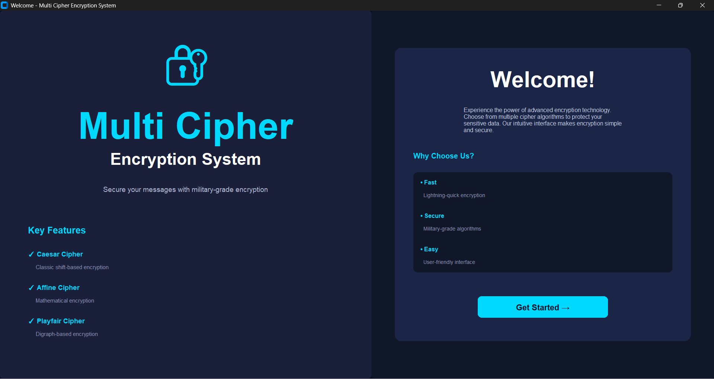
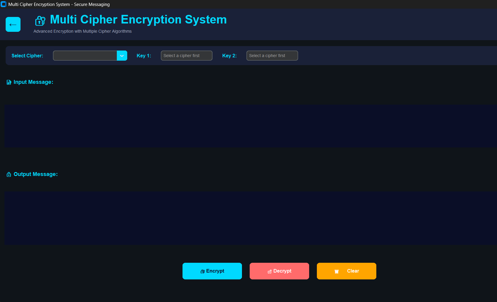
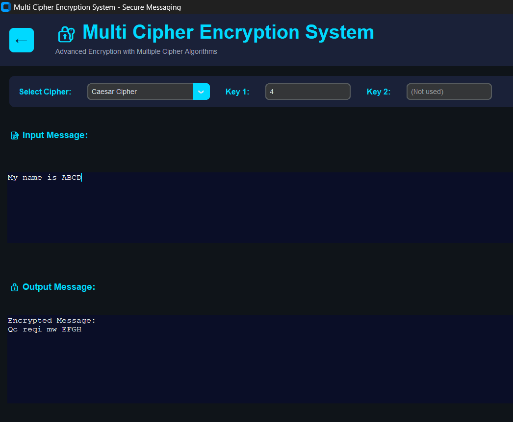

# Multi Cipher Encryption System

A Python-based GUI application that implements multiple classical encryption techniques for secure text encryption and decryption.

## Features
- Caesar Cipher
- Affine Cipher
- Playfair Cipher
- Encrypt and Decrypt functionality
- Modern GUI Interface
- Theme Switching
- Animated Progress Bar

## Technologies Used
- Python
- Tkinter
- CustomTkinter

## How to Run

1. Install Python

2. Install required library:
pip install customtkinter

3. Run the project:
python modern_gui.py

## Project Screenshots

### Homepage

### Encryption Page

### Working Demo

## Author
Simran